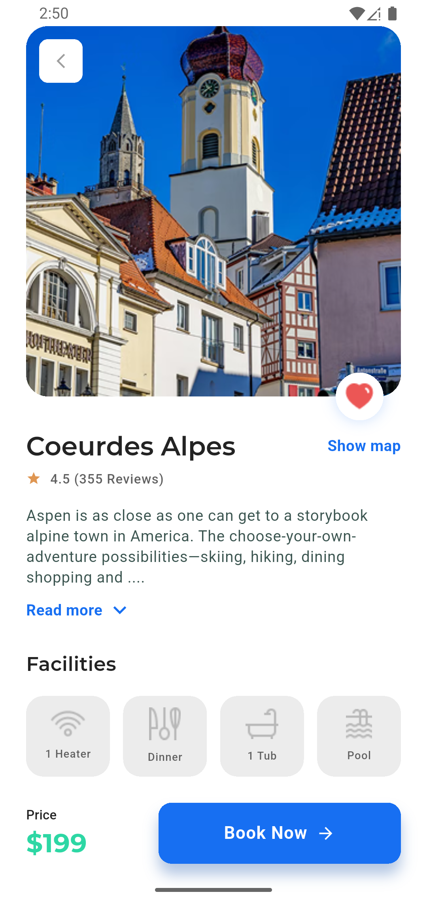

# Flutter UI Practice App

This is a **single-page Flutter application** built for practicing **UI implementation**.  
The design is based on the following **Figma file**, and the main page has been implemented:

🔗 [Figma Design Link](https://www.figma.com/community/file/1091615514005406765)

---

## 🖼️ Screenshot

  

---
